# 학습용으로 만들어 본 게시판 서비스

이 프로젝트는 학습용으로 만들어보는 게시판 클론 코딩 프로젝트입니다. 

가장 기본적이고 보편적인 게시판 기능을 둘러볼 수 있습니다. 

스프링 부트와 관련 기술들, 자바 17 기능들, 개발 도구들을 경험할 수 있었습니다.

## 결과물

* https://project-board-rko.herokuapp.com

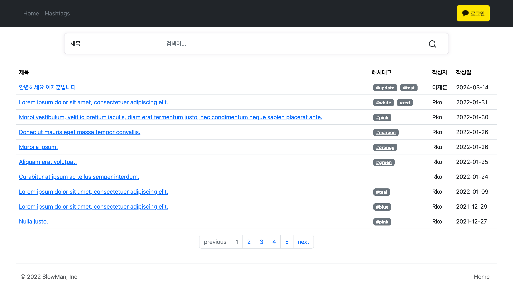

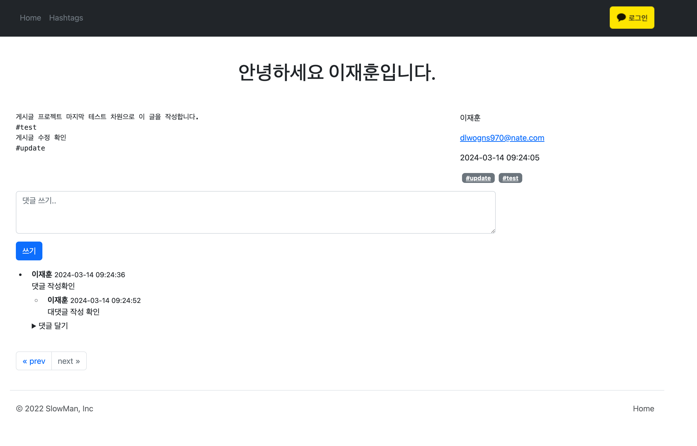

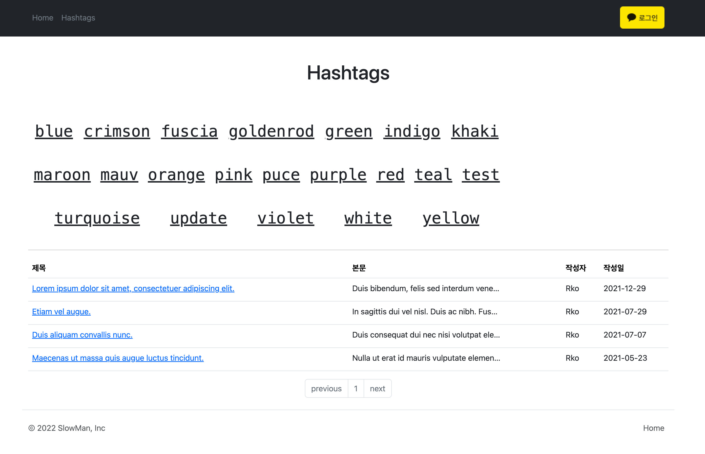

## 어플리케이션 아키텍처

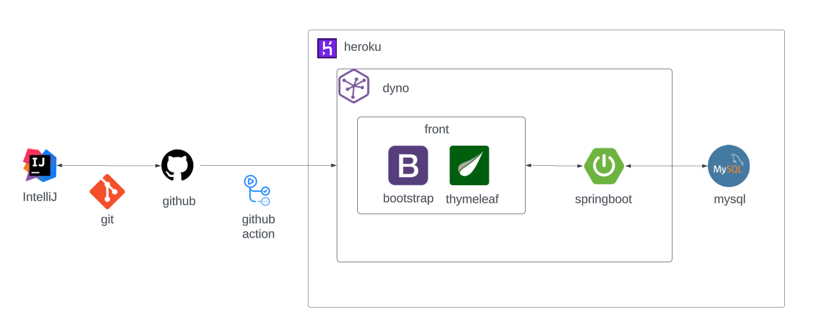

## ERD
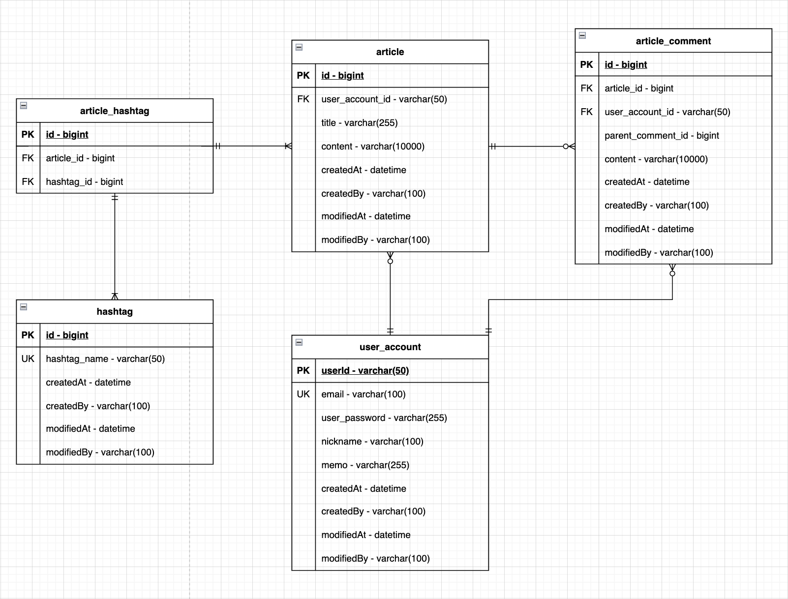

## 개발 환경

* `IntelliJ`
* `Java 17`
* `Gradle`
* `git/github`

## 기술 스택

* `Spring Boot MVC`
* `Spring Data JPA`
* `Spring Security`
* `MySQL`
* `QueryDSL`
* `Thymleaf`
* `Bootstrap`
* `Heroku`

## 주요 기능
- 카카오 OAuth 로그인
- 게시글 작성, 검색, 수정, 삭제
- 댓글 작성, 삭제
- 대댓글 작성, 삭제
- 해시태그 작성, 검색

## 시퀀스 다이어그램
- 카카오 OAuth 로그인
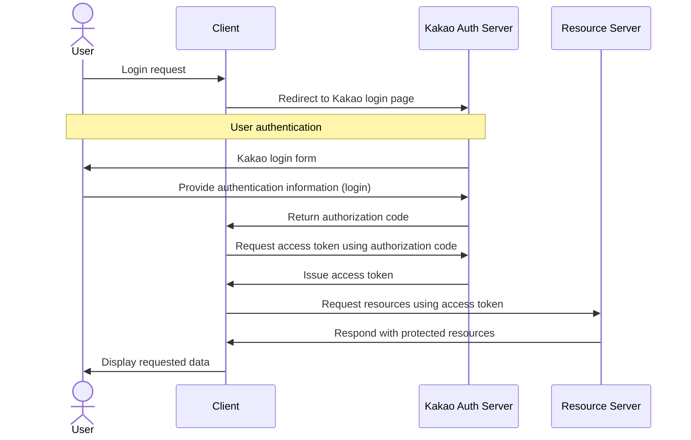

- 게시글 작성
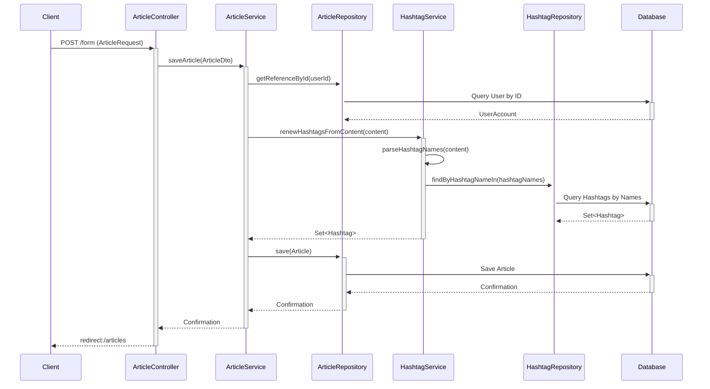

- 게시글 리스트 검색 및 조회 
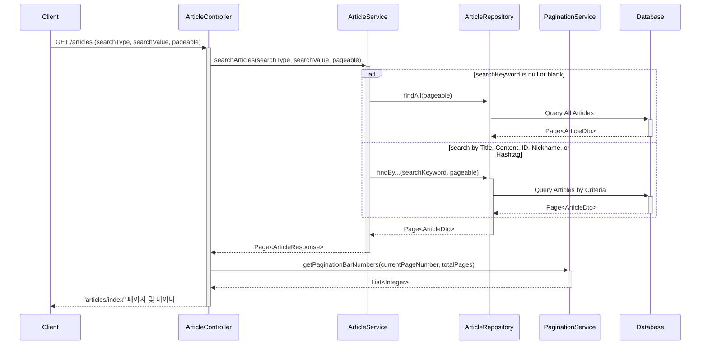

- 게시글 단 건 조회
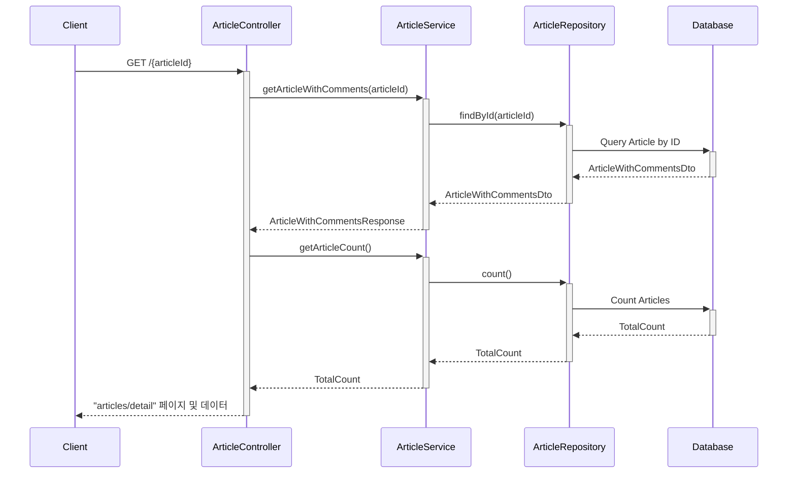

- 해시태그 검색
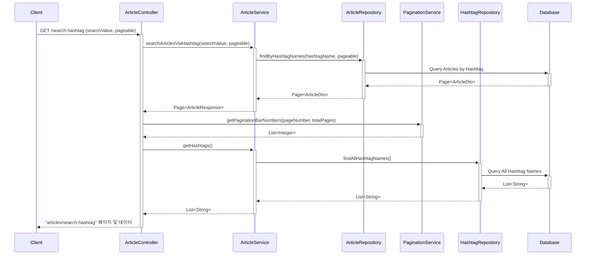

- 게시글 수정
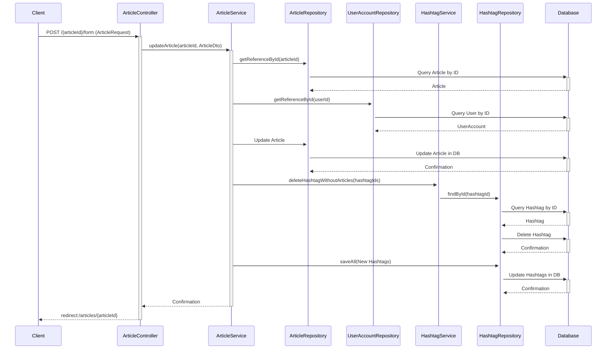

- 게시글 삭제
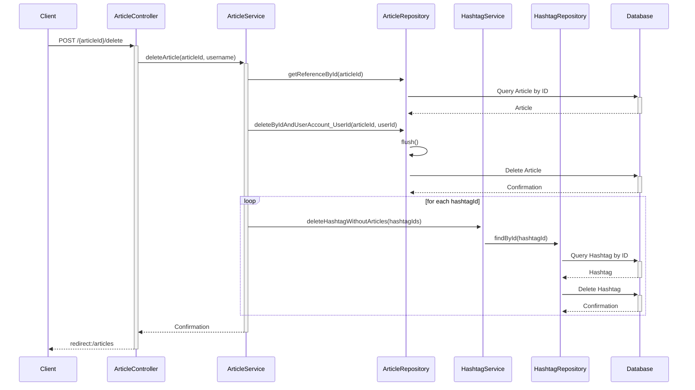

- 댓글 작성
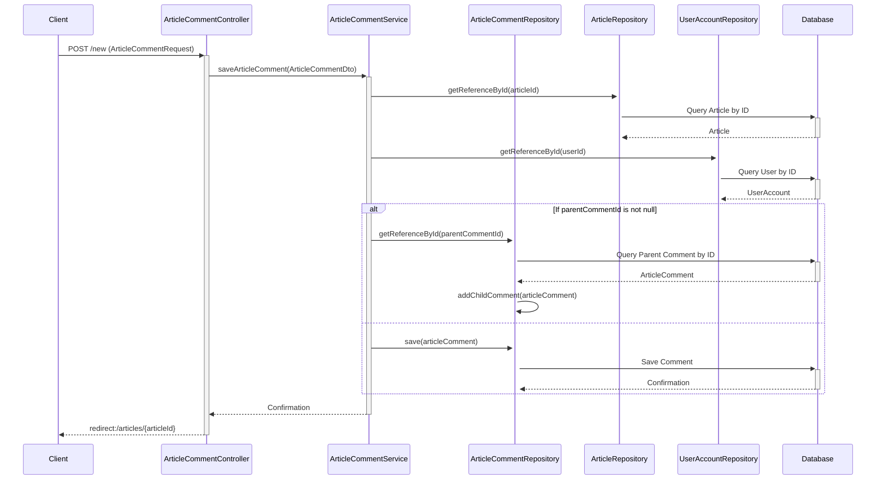

- 댓글 삭제
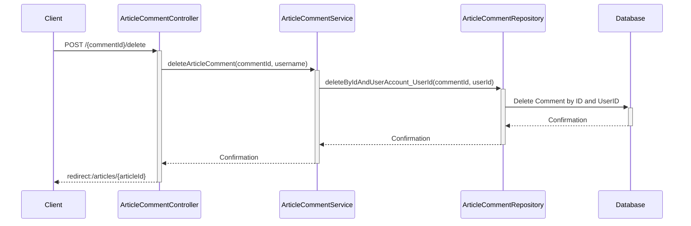